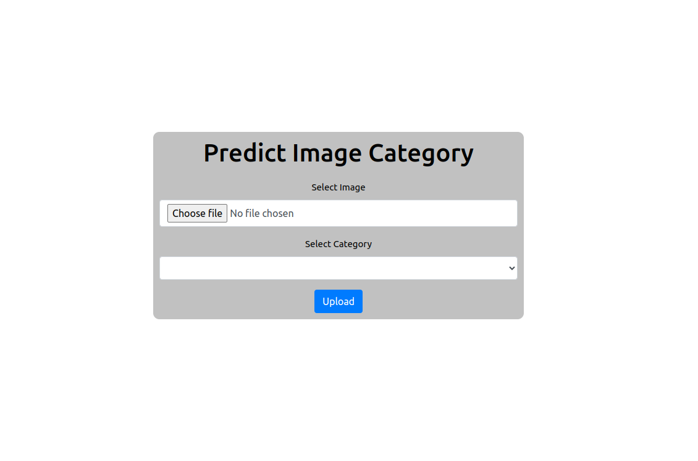
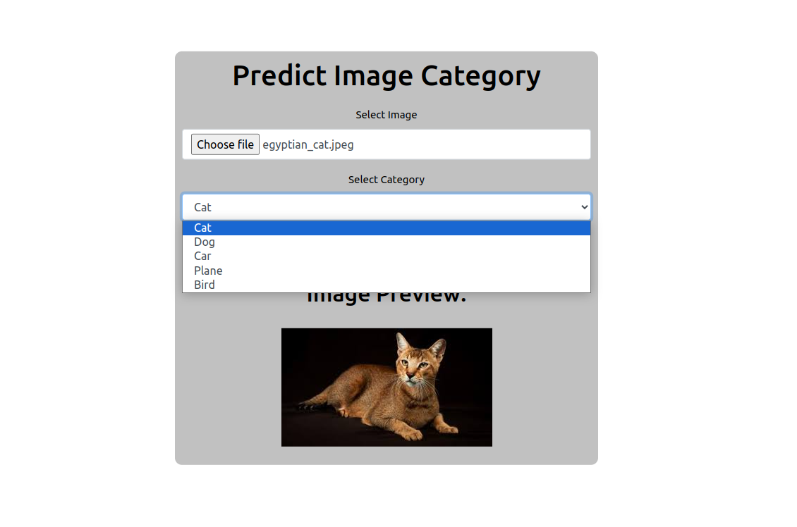
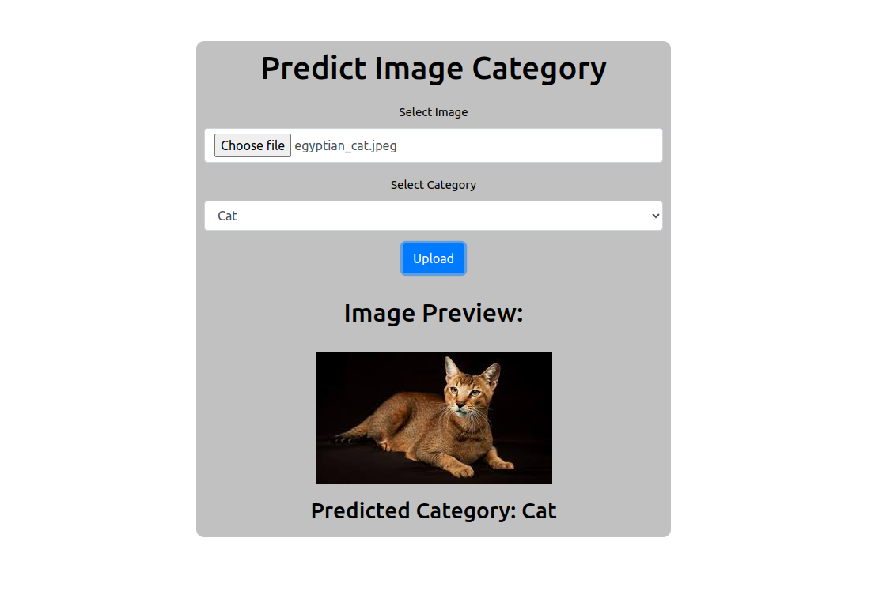
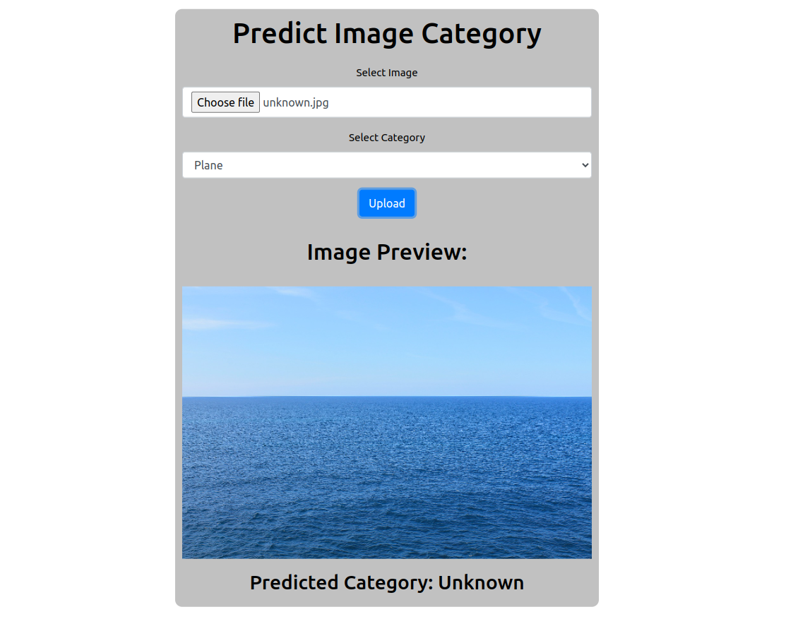

# Image Cetogory Classifier

## The problem

### Frontend (Vue.js)
Create an image upload page with a file selection form.  After loading the image, display it on the page.  
Add the ability to select a category from a predefined list (for example, "Food", "Nature", "Cities", etc.).
Provide a button to send the image and selected category to the server.

### Backend (Django)
Create a Django project with one application.
Implement a Django model to store information about images and their categories.
Set up a view to load images and store them in a database, and categorize them using a pre-trained AI model.
Create an API to get a list of uploaded images with their categories.

### AI
Use a pre-trained model for image classification (e.g., MobileNet, Inception, etc.).
Integrate the AI model with your Django application. The model should automatically categorize the uploaded images.

## Prerequisites
* Python 3.11.x
* Pipenv
* Docker
* Docker compose
* Make

### Tested with versions

* Python — 3.11.2
* Vue.js — 3.4.27
* Pipenv — 2023.3.20
* Docker — 25.0.4
* Docker compose — 2.24.7
* npm — 9.5.1
* Node.js — 19.8.1
* Make — 4.3
* OS — Ubuntu 22.04

## Makefile

Makefile is commonly used in Python to run custom scripts or commands associated with a project.
You can look at all existing commands for this project in `Makefile`.

To run any `Makefile` command just type:

```sh
make <command_name>
```

You can call `help` command to display all commands and their use cases:

```sh
make help
```

## How to run

1. Create a file `.env.backend` in the `image-classifier/backend/` and set up the envs as in `.env.backend.sample`.

2. Then you can run both applications (backend & frontend) with Docker Compose just entering:
    ```shell
    make start-server
    ```

3. When the docker containers are running access `http://localhost:8080/`.

## Developer endpoints

You can also access developer endpoints:

* `http://localhost:8000/admin` redirects to the admin panel with defined credentials in the env file.
* At `http://localhost:8000/api/v1/images/` (it also supports detailed view) you can see all created and categorized images.

## Example of usage

Here I provided several illustrations that display implemented interface and interaction with it.

|  |
|:-------------------------------------------------:|
|        *Initial state of the application*         |

|                         |
|:--------------------------------------------------------------------------:|
| *Image Preview after selecting one. It also displays categories to select* |

|            |
|:-------------------------------------------------------------------:|
| *Displayed predicted category by pre-trained AI model (ImageNetV2)* |

|   |
|:----------------------------------------:|
| *The result of uploading random picture* |

## Example images

If you don't want to waste your time looking for images on the Internet you can use example images in the `examples/images/` directory :)

## Notes

> **This application is just a test product and consciously missing such things as:**
> 
> **1. Lack of tests** 
> 
> **2. Lack of .env file for frontend**
> 
> **3. Lack of behavior when Django DEBUG=False**
> 
> **4. Lack of proper error handing on the frontend side**
